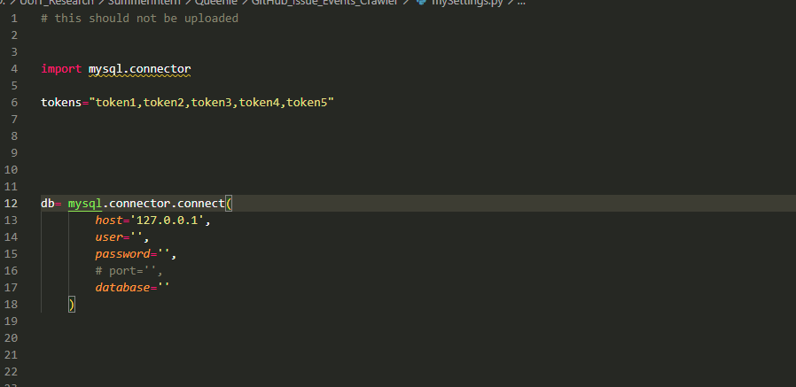

# GitHub Issue Events Crawler

A crawler for querying issue timeline events of GitHub Repositories

-----------timeline_events_crawler (saved to local files:

                Input repo_slug list

       Reminder: check the input repo list to ensure that there is no additional empty line at the bottom ❗️❗️❗️

-----------timeline_events_crawler_mysql (saved to database server:

                repo_list folder: 
                        first generate repo_list table by 1. create repo_list table.sql -> 
                                                             import morethan500pr.csv file -> 
                                                             repo_list.py
                                                             
                                                       or 2. by create repo_list table.sql -> 
                                                             insert repo_list morethan500pr query.sql
                                                             
 ❗️❗️❗️ Note that repo_list and issue_pr_event table contents may not be consistent if table structure changed by scripts. (eg. new columns)
       Then you need to rebuild the table by create...sql file and insert contents by scripts
       
       
       
 📝 Reminder: fill in or change the schema and table name in the sql insert query
                  
( in search_cross_ref.py ⬇️)

                  
                  
( in repo_list.py ⬇️)  

                  
                  
( in timeline_crawler_mysql.py ⬇️)   

                  

            
### Database connection set up
Create a new python file mySetting.py to store the github api tokens and database connection creditials 
 
